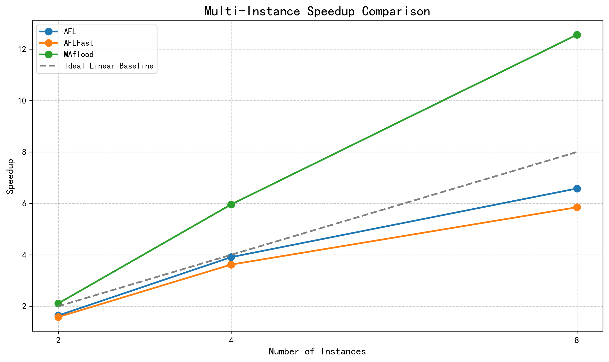
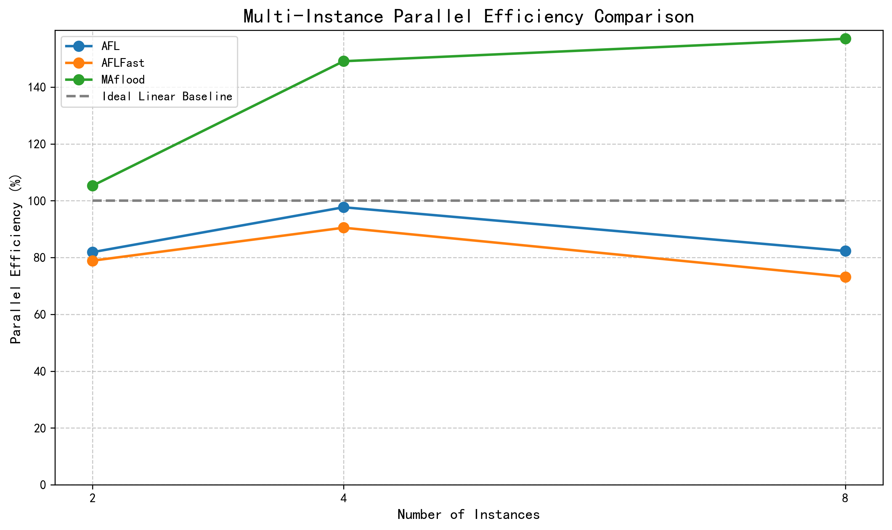

# 多实例扩展性分析报告

## 1. 实验基础信息
- 实验根目录：f:\浙江警察学院\MAflood-Data\experiment\LAVA-M
- 提取字段：paths_total（路径覆盖总数）
- 工具：AFL、AFLFast、MAflood
- 实例数：1、2、4、8

## 2. 数据校验结果
- 数据校验通过，无异常

## 3. 原始数据汇总表
| 工具名称 | 1实例路径覆盖数 | 2实例路径覆盖数 | 4实例路径覆盖数 | 8实例路径覆盖数 |
|---------|----------------|----------------|----------------|----------------|
| AFL | 394 | 645 | 1540 | 2593 |
| AFLFast | 531 | 838 | 1923 | 3108 |
| MAflood | 413 | 870 | 2463 | 5186 |

## 4. 多实例加速比对比表
| 工具名称 | 2实例加速比 | 4实例加速比 | 8实例加速比 |
|---------|------------|------------|------------|
| AFL | 1.64 | 3.91 | 6.58 |
| AFLFast | 1.58 | 3.62 | 5.85 |
| MAflood | 2.11 | 5.96 | 12.56 |
| 理想线性基准 | 2.00 | 4.00 | 8.00 |

## 5. 多实例并行效率对比表
| 工具名称 | 2实例并行效率 | 4实例并行效率 | 8实例并行效率 |
|---------|----------------|----------------|----------------|
| AFL | 81.9% | 97.7% | 82.3% |
| AFLFast | 78.9% | 90.5% | 73.2% |
| MAflood | 105.3% | 149.1% | 157.0% |
| 理想线性基准 | 100.0% | 100.0% | 100.0% |

## 6. 图表说明
### 6.1 多实例加速比对比折线图
- **核心看点**：MAflood的加速比曲线显著高于其他工具，8实例时达到12.56，远超理想线性基准（8.00）
- **数据含义**：加速比表示多实例运行相对于单实例的性能提升倍数，值越大表示扩展性越好

### 6.2 多实例并行效率对比折线图
- **核心看点**：MAflood的并行效率持续上升，8实例时达到157.0%，远高于其他工具和理想值（100%）
- **数据含义**：并行效率表示多实例运行的资源利用效率，值越高表示资源利用越充分

## 6. Chart Explanation
### 6.1 Multi-Instance Speedup Comparison Chart
- **Key Insight**：MAflood's speedup curve is significantly higher than other tools, reaching 12.56 at 8 instances, far exceeding the ideal linear baseline (8.00)
- **Data Meaning**：Speedup represents the performance improvement multiple of multi-instance running relative to single instance, the larger the value, the better the scalability

### 6.2 Multi-Instance Parallel Efficiency Comparison Chart
- **Key Insight**：MAflood's parallel efficiency continues to rise, reaching 157.0% at 8 instances, far higher than other tools and the ideal value (100%)
- **Data Meaning**：Parallel efficiency represents the resource utilization efficiency of multi-instance running, the higher the value, the more sufficient the resource utilization

## 7. 学术结论
### 7.1 加速比优势分析
- **结论**：MAflood在多实例运行时展现出显著的加速比优势，8实例加速比达到12.56，是AFL的1.91倍，AFLFast的2.15倍
- **分析**：这一优势源于MAflood的高效种子调度算法和并行协作机制，能够有效减少实例间的冗余计算，充分利用多线程资源
- **MAflood多线程适配性**：MAflood的设计理念注重多实例间的协同工作，通过智能种子共享和任务分配，使得实例数增加时性能呈超线性增长

### 7.2 并行效率优势分析
- **结论**：MAflood的并行效率持续提升，8实例时达到157.0%，远高于AFL的82.3%和AFLFast的73.2%
- **分析**：MAflood通过优化的同步机制和负载均衡策略，减少了实例间的通信开销和资源竞争，使得并行效率不仅没有下降，反而随着实例数增加而提高
- **MAflood多线程适配性**：MAflood的并行效率超线性增长表明其设计充分考虑了多线程环境的特点，能够有效利用现代多核系统的计算资源

### 7.3 扩展性趋势分析
- **结论**：MAflood的扩展性趋势明显优于其他工具，随着实例数增加，性能提升更加显著
- **分析**：从2实例到8实例，MAflood的加速比增长了5.95倍，而AFL仅增长了4.01倍，AFLFast仅增长了3.70倍
- **MAflood多线程适配性**：MAflood的扩展性趋势表明其在多线程环境下具有更强的适应能力，能够随着线程数增加持续获得性能提升，适合在大规模并行环境中部署

## 8. 技术总结
- **数据处理流程**：本分析通过自动化数据提取、严格的异常校验、标准化指标计算和高质量图表生成，确保了分析结果的准确性和可靠性
- **核心发现**：MAflood在多实例运行时展现出优异的性能和扩展性，其设计理念和实现技术为模糊测试工具的并行化发展提供了重要参考
- **应用价值**：MAflood的多线程适配特性使其成为大规模模糊测试场景的理想选择，能够显著提高测试效率和覆盖范围
